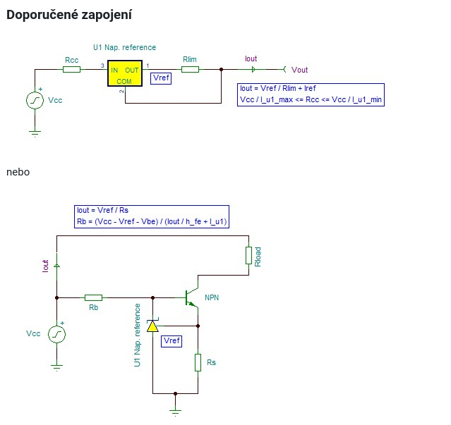

# Zdroj proudu s vhodnou napetovou referenci
Projekt do predmetu BCP-MPS.

## Poznamky ze cviceni
- do dvou tydnu zkusit sehnat soucatku a spustit experiment, aby se overilo, zda je zadani mozn
e (mail nebo osobne)˰
- zadani 11: `TL431` (3-bodova ref.), `LT1001` (2-bodova ref., uz ale starsi), `REF2020` (draha ref. 3-bodova od Texasu)˰
- prvni schema se bezne pouziva, ale modely soucastek nejsou staveny na pruchod proudu, takze pouzit nahradni 
- experiment libovolny provest jen s prostredky spice

# Zadani projektu

## Doporucena zapojeni
Zapojeni nize bylo poskytnuto vyucujicim

***
- Získejte z Internetu nebo jiným způsobem model vybrané vhodné klíčové součástky (Nap_reference) pro PSpice.
  
- Získejte katalogový list (datasheet) k vybrané klíčové součástce.
  
- S modelem klíčové součástky sestavte zdroj proudu (zvolte hodnotu Iout mezi 5 mA a 50 mA) podle doporučeného zapojení.
  
- Experiment č. 1: Změřte teplotní koeficient proudu Iout při zátěži 100 Ω a Vcc = 5 V. Zjistěte závislost proudu Iout na velikosti zátěže. Ověřte výpočtem maximální hodnotu zátěže, kterou ještě může protékat nastavený konstantní proud.
  
- Experiment č. 2: Analyzujte spektrální hustotu šumového výkonu a proudu zátěží v kmitočtovém pásmu 1 Hz až 150 kHz. Zjistěte efektivní hodnotu šumového proudu v tomto frekvenčním pásmu (a srovnejte ji s velikostí pracovního proudu Iout).
- Experiment č. 3: Proveďte další experiment dle vlastního uvážení.